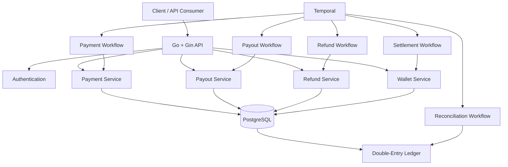
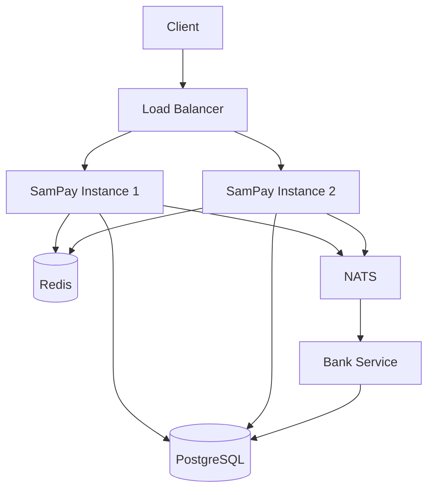

# SamPay 💳

<p align="center">
  <strong>A backend-focused fintech system built with Go to explore payments, accounting, workflows, concurrency, and distributed systems.</strong>
</p>

<p align="center">
  
  
  
  
</p>

<p align="center">
  
  
</p>

---

## 🚀 What is SamPay?

**SamPay** is a backend-focused fintech system built with Go.

The goal is not to build another CRUD application. SamPay is being developed as a practical environment for understanding the engineering problems behind financial systems:

* 💳 Payment processing
* 💰 Wallets and vaults
* 📒 Double-entry accounting
* 🔐 Idempotency
* 💸 Payouts
* ↩️ Refunds
* 📅 Settlement
* 🔎 Reconciliation
* ⏱️ Temporal workflows
* ⚡ Concurrency and transaction safety
* 📈 Load testing
* 📡 Service-to-service communication
* 🧪 Failure and recovery testing
* 🚀 Distributed system design

The project follows a simple engineering philosophy:

> **Build it → Understand it → Break it → Scale it → Fix it**

---

# 🏗️ Architecture

## Current Architecture

SamPay currently uses a modular backend architecture with PostgreSQL as the primary source of financial state and Temporal for workflow orchestration.



The current architecture deliberately keeps financial operations inside the application while using Temporal to orchestrate longer-running business workflows.

---

# 🎯 Engineering Goals

SamPay is being developed around several backend engineering problems that are particularly important in financial systems.

### Financial correctness

* Atomic financial transactions
* Double-entry ledgering
* Balance consistency
* Wallet and vault accounting
* Settlement
* Reconciliation

### Reliability

* Idempotent APIs
* Temporal retries
* Failure recovery
* Concurrent request handling
* Database locking
* Transaction rollback

### Scalability

* Baseline load testing
* Redis
* Multiple application instances
* Load balancing
* Asynchronous service communication
* NATS

The infrastructure is intentionally being introduced **incrementally** rather than adding distributed components before there is a baseline to compare against.

---

# 💰 Financial Architecture

SamPay uses a **double-entry ledger** to represent financial movements.

Every ledger transaction must satisfy:

```text
Total Debit == Total Credit
```

Financial balances and ledger entries are updated within database transactions to maintain consistency.

## Example: Wallet → Bank Payout

For a ₹1,000 payout with a ₹10 fee:

```text
Merchant Wallet
      │
      │ Debit ₹1,010
      ▼
 Payout Vault
      │
      ├── Credit ₹1,000 → Bank Account
      │
      └── Debit ₹10
              │
              ▼
        Company Vault
```

Ledger representation:

```text
Wallet        DR  ₹1,010
Payout Vault  CR  ₹1,010

Payout Vault  DR  ₹1,000
Bank Account  CR  ₹1,000

Payout Vault  DR  ₹10
Company Vault  CR  ₹10
```

The reconciliation system can subsequently verify the accounting integrity of these transactions.

---

# 💳 Core Financial Flows

## Payment

```text
Client
  │
  ▼
Payment API
  │
  ▼
Temporal Payment Workflow
  │
  ├── Validate Request
  ├── Calculate Fees
  ├── Create Payment
  └── Execute Payment
          │
          ├── Wallet Balance
          ├── Payment Vault
          ├── Company Vault
          └── Ledger
```

Implemented concepts include:

* Payment creation
* Payment status management
* Idempotency
* Payment expiry
* Long-lived payments
* Manual payment refresh
* Wallet reservation
* Automatic wallet top-up
* Payment vault accounting
* Fee accounting
* Double-entry ledger entries

---

## 💸 Payout

### Wallet → Bank

```text
Merchant Wallet
       ↓
  Payout Vault
       ↓
   Bank Account
```

Supports:

* Balance validation
* Fee calculation
* Wallet reservation
* Vault movement
* Bank account credit
* Company fee collection
* Ledger entries

### Bank → Bank

```text
Source Bank
     ↓
Destination Bank
```

The bank-to-bank flow currently operates without payout fees.

---

## ↩️ Refund

Refund funding depends on the settlement state of the original payment.

### Before Settlement

```text
Payment Vault
      ↓
Merchant / Customer Wallet
```

### After Settlement

```text
Merchant Wallet
      ↓
Customer / Sender Wallet
```

If the merchant wallet does not have sufficient funds after settlement, SamPay can automatically top up the wallet from the linked primary bank account before processing the refund.

---

## 🔄 Auto Top-Up

Automatic top-up is treated as a financial transaction rather than simply modifying a balance.

```text
Bank Account
     │
     │ DR ₹1,000
     ▼
Merchant Wallet
     │
     │ CR ₹1,000
```

The movement is represented in the ledger and therefore participates in reconciliation.

---

# 📅 Settlement

Settlement moves merchant funds from reserved state into available funds and marks the corresponding payments as settled.

```text
Reserved Balance
       ↓
Available Balance
       ↓
Payment = SETTLED
```

Settlement is orchestrated using a Temporal workflow and can be triggered through scheduled execution.

---

# 🔎 Reconciliation

SamPay currently focuses on **internal ledger reconciliation**.

The reconciliation flow verifies that every ledger transaction balances:

```text
Ledger Transactions
        ↓
Ledger Entries
        ↓
Group by Transaction
        ↓
Calculate Debit / Credit
        ↓
Debit == Credit ?
       /       \
     YES        NO
      ↓          ↓
   Matched     Failed
```

Failed reconciliation records include information such as:

* Ledger transaction ID
* Reference ID
* Total debit
* Total credit
* Difference

A reconciliation report can then be generated and delivered through email.

---

# ⏱️ Temporal Workflows

Temporal is used for business processes that should not depend entirely on a single synchronous HTTP request.

Current workflows include:

```text
Payment
Payout
Refund
Settlement
Reconciliation
```

Scheduled workflows include:

```text
Daily Settlement
Daily Reconciliation
```

The workflow layer is intentionally focused on **orchestration**, while business and financial operations are implemented within activities and services.

---

# 🔐 Idempotency

Payment requests support idempotency keys.

The database enforces uniqueness using:

```text
(merchant_id, idempotency_key)
```

The implementation uses an atomic insert-first approach rather than a separate:

```text
SELECT → INSERT
```

flow.

Concurrent requests using the same key are therefore prevented from creating duplicate payments.

Example behavior:

```text
10 concurrent requests
        │
        ▼
 Same Idempotency-Key
        │
        ├── 1 request → Payment processing
        │
        ├── Requests during processing
        │        → 409 REQUEST_IN_PROGRESS
        │
        └── Retry after completion
                 → Stored response
```

---

# 🔒 Concurrency & Transaction Safety

Financial operations use PostgreSQL transactions and row-level locking where required.

For example, concurrent wallet operations can use:

```sql
SELECT ...
FROM wallets
WHERE merchant_id = ?
FOR UPDATE;
```

This prevents multiple concurrent operations from reading and modifying the same financial balance without synchronization.

The payment execution flow performs its financial mutations inside a single database transaction.

If an operation fails, the transaction is rolled back.

---

# 🧪 Testing & Reliability

Testing is being approached as an engineering exercise rather than simply checking whether API endpoints return `200`.

## Payment Workflow Testing

The payment workflow has currently been tested for:

| Test                              | Result |
| --------------------------------- | :----: |
| Sustained Payment Load            |    ✅   |
| Concurrent Payments               |    ✅   |
| Concurrent Auto Top-Up            |    ✅   |
| Idempotency Under Concurrency     |    ✅   |
| Transactional Financial Updates   |    ✅   |
| Temporal Activity Failure & Retry |    ✅   |
| Temporal Server Outage & Recovery |    ✅   |

### Temporal Activity Retry

A temporary failure was injected into `ExecutePayment`.

Configured retry policy:

```text
Initial Interval:     2 seconds
Backoff Coefficient:  2.0
Maximum Interval:     30 seconds
Maximum Attempts:     5
```

Observed behavior:

```text
ExecutePayment Attempt 1
        ↓
Temporary Failure
        ↓
Retry
        ↓
ExecutePayment Attempt 2
        ↓
Success
```

The workflow successfully recovered and the API ultimately returned `200`.

### Temporal Server Outage

Payment load testing was performed while temporarily stopping and restarting Temporal.

One test used:

```text
2 RPS × 30 seconds
60 requests
```

Observed:

```text
HTTP 200              23
HTTP 500              37
Completed Payments    24
Pending Payments       0
Failed Payments        0
Payment Ledger Txns   24
```

No duplicate payment ledger transactions were observed.

An important behavior identified during this test is that an HTTP request can return `500` while the underlying Temporal workflow subsequently completes after Temporal recovers.

This highlights the importance of idempotency when clients retry requests after ambiguous failures.

---

# 🧪 Remaining Testing

The payment workflow has been sufficiently tested for the current development phase.

Remaining financial-flow testing will focus on:

* Payouts
* Refunds
* Settlement edge cases
* Reconciliation edge cases

More advanced failure scenarios around activity failure after financial side effects may be explored later.

---

# ⚡ Load Testing

SamPay includes custom Go-based load-testing utilities.

The objective is to establish a measurable baseline before introducing additional infrastructure.

Current testing focuses on:

* Requests per second
* Concurrent execution
* Latency
* Success/failure rate
* Database consistency
* Financial balance consistency
* Workflow behavior under failure

The load tests will continue to be used throughout development to compare system behavior as new components are introduced.

---

# 🚀 Distributed System Roadmap

The system will progressively evolve from the current architecture toward a distributed architecture.

## Target Architecture



The distributed architecture will be introduced gradually.

---

# 📚 Redis

Redis is the next infrastructure component being explored.

Potential SamPay use cases include:

* Caching
* Rate limiting
* Frequently accessed data
* Temporary state
* Reducing unnecessary database reads
* Atomic operations

Redis will first be explored independently before being integrated into SamPay.

The goal is to understand **why Redis is useful**, rather than simply adding it because it is a popular technology.

---

# 📡 NATS

NATS will eventually be introduced for asynchronous service-to-service communication.

Planned architecture:

```text
SamPay
   │
   │ NATS
   ▼
Bank Service
```

Potential use cases include:

* Bank service communication
* Event-driven processing
* Asynchronous operations
* Decoupling services

---

# 🏦 Bank Service Separation

The banking functionality will eventually be extracted into a separate service.

Initial target:

```text
┌───────────────┐
│    SamPay     │
└───────┬───────┘
        │
       NATS
        │
        ▼
┌───────────────┐
│  Bank Service │
└───────┬───────┘
        │
        ▼
   PostgreSQL
```

This will provide an opportunity to explore:

* Service boundaries
* Asynchronous communication
* Message delivery
* Failure handling
* Eventual consistency
* Distributed transactions

---

# 🔀 Multiple Application Instances

The application will eventually run as multiple instances:

```text
                  ┌─────────────────┐
                  │  Load Balancer  │
                  │      :8080      │
                  └────────┬────────┘
                           │
                ┌──────────┴──────────┐
                ▼                     ▼
         ┌─────────────┐       ┌─────────────┐
         │ SamPay #1   │       │ SamPay #2   │
         │    :8081    │       │    :8082    │
         └──────┬──────┘       └──────┬──────┘
                │                     │
                └──────────┬──────────┘
                           ▼
                     PostgreSQL
```

The purpose is to understand what changes when the application is no longer running as a single process.

---

# 🧪 Failure Experiments

Once the distributed architecture is introduced, SamPay will be used to experiment with failures such as:

* Concurrent requests
* Duplicate requests
* Database contention
* Redis failures
* NATS failures
* Application instance failures
* Service downtime
* Message delivery failures
* Workflow failures
* Partial system failures
* Recovery after infrastructure failures

The goal is not simply to make the system "work", but to understand **how and why it fails**.

---

# 🛠️ Tech Stack

| Technology     | Purpose                                    |
| -------------- | ------------------------------------------ |
| **Go**         | Backend application                        |
| **Gin**        | HTTP framework                             |
| **GORM**       | Database access                            |
| **PostgreSQL** | Primary database                           |
| **Temporal**   | Workflow orchestration                     |
| **Redis**      | Planned caching / rate limiting            |
| **NATS**       | Planned service communication              |
| **Docker**     | Planned infrastructure / local environment |

---

# 🧠 What I'm Learning

SamPay is being used to develop practical understanding of:

* Backend architecture
* Financial accounting
* Double-entry bookkeeping
* Database transactions
* Row-level locking
* Idempotency
* Workflow orchestration
* Concurrency
* Distributed systems
* Asynchronous communication
* Caching
* Scalability
* Fault tolerance
* Reconciliation
* Load testing
* Failure recovery
* Service boundaries

---

# 🗺️ Roadmap

```text
                 SamPay
                    │
                    ▼
          Core Financial Flows
                    │
       ┌────────────┼────────────┐
       ▼            ▼            ▼
    Payment       Payout       Refund
       │            │            │
       └────────────┼────────────┘
                    ▼
                Settlement
                    │
                    ▼
             Reconciliation
                    │
                    ▼
               Refactoring
                    │
                    ▼
            Automated Testing
                    │
                    ▼
              Load Testing
                    │
                    ▼
                 Redis
                    │
                    ▼
           Bank Service Split
                    │
                    ▼
                  NATS
                    │
                    ▼
          Multiple Instances
                    │
                    ▼
             Load Balancer
                    │
                    ▼
           Failure Experiments
                    │
                    ▼
          Production Hardening
```

---

# 🚀 Local Setup

## Prerequisites

Make sure the following are installed:

* [Go](https://go.dev/)
* [PostgreSQL](https://www.postgresql.org/)
* [Temporal CLI](https://docs.temporal.io/cli)
* Git

Optional:

* Postman / Bruno / Insomnia
* Docker

---

## Clone the Repository

```bash
git clone <your-repository-url>
cd SamPay
```

---

## Install Dependencies

```bash
go mod download
```

---

## Configure PostgreSQL

Create a PostgreSQL database for SamPay.

Example:

```sql
CREATE DATABASE sampay;
```

Update the application configuration with your local PostgreSQL connection details.

Example:

```text
Host:     localhost
Port:     5432
Database: sampay
User:     postgres
```

---

## Start Temporal

```bash
temporal server start-dev
```

Default local endpoints:

```text
Temporal Server: localhost:7233
Temporal UI:     http://localhost:8233
```

The Temporal UI can be used to inspect:

* Workflows
* Activities
* Retries
* Failures
* Workflow history

---

## Start SamPay

From the project root:

```bash
go run .
```

The API runs on:

```text
http://localhost:8080
```

---

## Run Tests

Run all tests:

```bash
go test ./...
```

Run with the race detector:

```bash
go test -race ./...
```

Run verbose:

```bash
go test -v ./...
```

---

# ⚠️ Project Status

SamPay is an **actively evolving engineering project**.

The core financial flows are implemented, and the project is currently moving from:

```text
Working Financial Backend
        ↓
Testing & Benchmarking
        ↓
Distributed Systems
        ↓
Failure Experiments
        ↓
Production Hardening
```

The project intentionally prioritizes **understanding the engineering trade-offs** over prematurely introducing infrastructure.

---

# ⚠️ Disclaimer

SamPay is a **learning and experimentation project**.

It is not intended to process real money or be used as a production payment platform.

Financial flows, APIs, architecture, and infrastructure will continue to evolve throughout development.

---

# 📈 Project Philosophy

> **Build it → Understand it → Break it → Scale it → Fix it**

The goal is to take a working financial backend and progressively evolve it into a system capable of handling:

**scale · concurrency · failures · distributed execution**

---

## 👨‍💻 Author

**Samarth Srivastava**

Backend Software Engineer focused on:

**Go · Fintech · Backend Engineering · Distributed Systems**

---

⭐ If you're interested in backend engineering, fintech systems, or distributed systems, feel free to explore the project.
