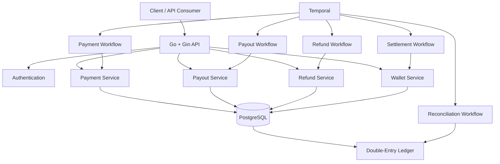
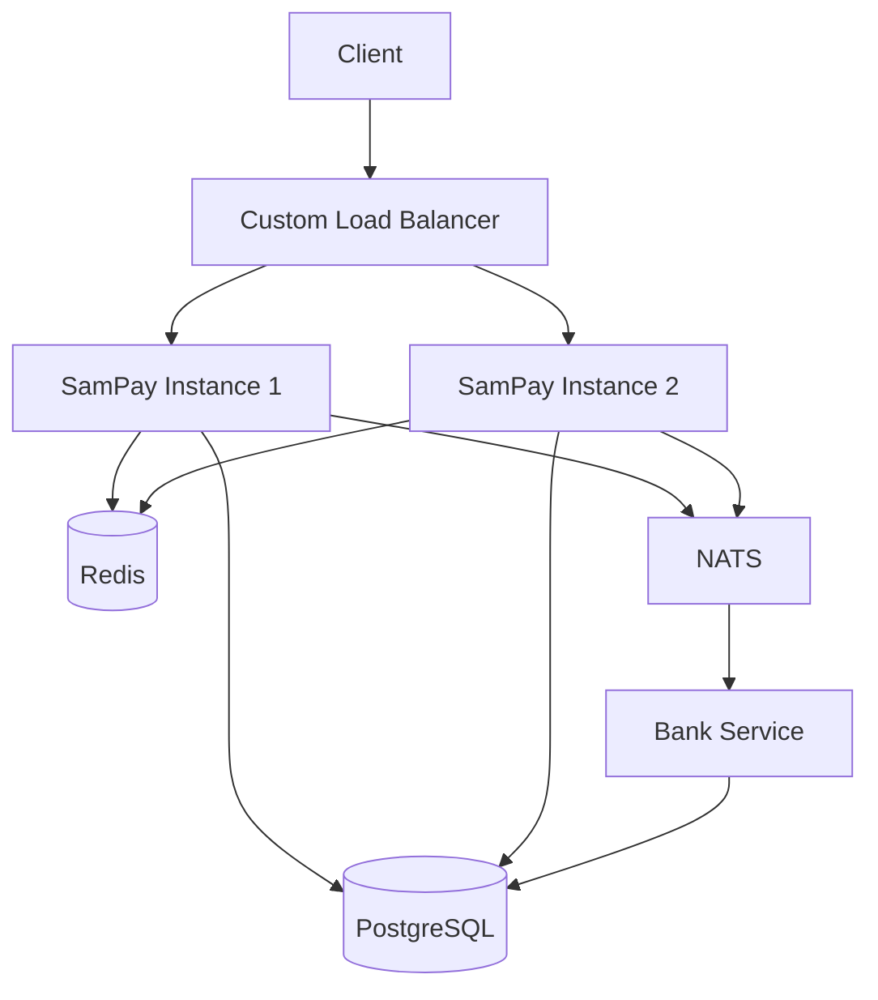

# SamPay 💳

<p align="center">
  <strong>A backend-focused fintech system built with Go to explore payments, accounting, workflows, and distributed systems.</strong>
</p>

<p align="center">
  
  
  
  
</p>

<p align="center">
  
  
  
</p>

---

## 🚀 What is SamPay?

**SamPay** is a backend-focused fintech project built in Go.

The objective is not to build another CRUD application. SamPay is being developed as a practical environment for understanding the engineering problems behind financial systems:

* 💳 Payment processing
* 💰 Wallets and vaults
* 📒 Double-entry accounting
* 🔐 Idempotency
* 💸 Payouts
* ↩️ Refunds
* 📅 Settlement
* 🔎 Reconciliation
* ⏱️ Temporal workflows
* ⚡ Concurrency and scalability
* 📡 Service-to-service communication
* 🧪 Failure and load testing

The project is intentionally being developed in stages:

> **Build it → Understand it → Break it → Scale it → Fix it**

---

## 📊 Project Status

> **SamPay is approximately 50% complete.**

The initial financial/business flows are implemented. The remaining work focuses primarily on **refactoring, testing, scalability, distributed architecture, and failure handling**.

| Component                       | Status |
| ------------------------------- | :----: |
| Authentication & API Protection |    ✅   |
| Merchant / User Management      |    ✅   |
| Payments                        |    ✅   |
| Wallets                         |    ✅   |
| Vaults                          |    ✅   |
| Double-Entry Ledger             |    ✅   |
| Payouts                         |    ✅   |
| Refunds                         |    ✅   |
| Settlement                      |    ✅   |
| Reconciliation                  |    ✅   |
| Temporal Workflows              |    ✅   |
| Refactoring                     |   🚧   |
| Automated Tests                 |   🚧   |
| Load Testing                    |   🚧   |
| Redis                           |   🚧   |
| Bank Service Separation         |   🚧   |
| NATS                            |   🚧   |
| Multiple Instances              |   🚧   |
| Load Balancer                   |   🚧   |
| Failure Experiments             |   🚧   |
| Production Hardening            |   🚧   |

---

# 🏗️ Architecture

### Current Architecture



### Target Architecture

The system will progressively evolve toward a multi-instance, distributed architecture:



The distributed architecture will be introduced **after the core implementation and baseline load testing**, rather than adding infrastructure prematurely.

---

# 💰 Financial Architecture

SamPay uses a **double-entry ledger** as the source of truth for financial movements.

Every financial transaction should balance:

```text
Total Debit == Total Credit
```

### Example: Wallet → Bank Payout

For a ₹1,000 payout with a ₹10 fee:

```text
Merchant Wallet
      │
      │ Debit ₹1,010
      ▼
 Payout Vault
      │
      ├── Credit ₹1,000 → Bank Account
      │
      └── Debit ₹10
              │
              ▼
        Company Vault
```

Ledger representation:

```text
Wallet        DR  ₹1,010
Payout Vault  CR  ₹1,010

Payout Vault  DR  ₹1,000
Bank Account  CR  ₹1,000

Payout Vault  DR  ₹10
Company Vault  CR  ₹10
```

The reconciliation system later verifies that each ledger transaction satisfies:

```text
Debit == Credit
```

---

# 💳 Core Financial Flows

## Payment

```text
Customer
   │
   ▼
Payment API
   │
   ▼
Payment Workflow
   │
   ├── Idempotency
   ├── Validation
   ├── Payment Expiry
   └── Wallet / Vault Accounting
```

Implemented concepts include:

* Payment creation
* Idempotency
* Payment status management
* Payment expiry
* Long-lived payments
* Manual payment refresh
* Payment vault
* Merchant wallet interaction

---

## 💸 Payout

### Wallet → Bank

```text
Merchant Wallet
       ↓
  Payout Vault
       ↓
   Bank Account
```

Supports:

* Balance validation
* Fee calculation
* Wallet reservation
* Vault movement
* Bank account credit
* Company fee collection
* Ledger entries

### Bank → Bank

```text
Source Bank
     ↓
Destination Bank
```

A direct transfer without payout fees.

---

## ↩️ Refund

Refund funding depends on settlement state.

### Before Settlement

```text
Payment Vault
      ↓
Customer / Sender Merchant Wallet
```

### After Settlement

```text
Merchant Wallet
      ↓
Customer / Sender Merchant Wallet
```

If the merchant wallet is insufficient after settlement, SamPay can automatically top up the wallet from its linked primary bank account before processing the refund.

---

## 🔄 Auto Top-Up

Auto top-up is treated as a financial transaction and recorded in the ledger.

```text
Bank Account
     │
     │ DR ₹1,000
     ▼
Merchant Wallet
     │
     │ CR ₹1,000
```

This means the top-up is also covered by reconciliation.

---

# 📅 Settlement

Settlement currently moves merchant funds from:

```text
Reserved Balance
       ↓
Available Balance
```

and marks the corresponding payments as:

```text
SETTLED
```

Settlement is implemented as a **global Temporal workflow** and can be triggered through a scheduled execution.

---

# 🔎 Reconciliation

The initial reconciliation system focuses on **internal ledger integrity**.

For a selected reconciliation period:

```text
Ledger Transactions
        ↓
Ledger Entries
        ↓
Group by LedgerTransactionID
        ↓
Calculate Debit / Credit
        ↓
Debit == Credit ?
       /       \
     YES        NO
      ↓          ↓
   Matched     Failed
```

Failed transactions contain:

* Ledger Transaction ID
* Reference ID
* Total Debit
* Total Credit
* Difference

A report is generated and sent by email.

---

# ⏱️ Temporal Workflows

Temporal is used to orchestrate business processes that should not depend entirely on a single synchronous HTTP request.

Current workflows include:

```text
Payment
Payout
Refund
Settlement
Reconciliation
```

Scheduled workflows currently include:

```text
Daily Settlement
Daily Reconciliation
```

The workflow layer is intentionally kept focused on **orchestration**, while business and financial operations are implemented in activities/services.

---

# 🔌 API Examples

> The API surface will continue to evolve as the project is refactored.

### Create Payment

```http
POST /payments
Content-Type: application/json
Idempotency-Key: payment_123
```

```json
{
  "merchant_id": "merchant-uuid",
  "amount": "1000",
  "currency": "INR"
}
```

---

### Create Payout

```http
POST /payouts
Content-Type: application/json
Idempotency-Key: payout_123
```

```json
{
  "merchant_id": "merchant-uuid",
  "amount": "1000",
  "currency": "INR"
}
```

---

### Create Refund

```http
POST /refunds
Content-Type: application/json
```

```json
{
  "payment_id": "payment-uuid",
  "merchant_id": "merchant-uuid",
  "amount": "500",
  "currency": "INR",
  "reason": "Customer requested refund"
}
```

---

### Get Wallet Transactions

```http
GET /merchants/{merchant_id}/wallet?type=credit
```

Example response:

```json
{
  "success": true,
  "data": {
    "transactions": []
  }
}
```

> These examples represent the current project direction; endpoint names and request/response contracts may change during refactoring.


---

# 🛠️ Tech Stack

| Technology     | Purpose                         |
| -------------- | ------------------------------- |
| **Go**         | Backend application             |
| **Gin**        | HTTP framework                  |
| **GORM**       | ORM / database access           |
| **PostgreSQL** | Primary database                |
| **Temporal**   | Workflow orchestration          |
| **Redis**      | Planned caching / rate limiting |
| **NATS**       | Planned service communication   |

# 🚀 Local Setup

Follow these steps to run SamPay locally.

## Prerequisites

Make sure the following are installed:

* [Go](https://go.dev/)
* [PostgreSQL](https://www.postgresql.org/)
* [Temporal CLI](https://docs.temporal.io/cli)
* Git

Optional tools:

* Postman / Bruno / Insomnia for API testing
* Docker

---

## 1. Clone the Repository

```bash
git clone <your-repository-url>
cd SamPay
```

---

## 2. Install Go Dependencies

```bash
go mod download
```

Or:

```bash
go mod tidy
```

---

## 3. Configure PostgreSQL

Create a PostgreSQL database for SamPay.

Example:

```sql
CREATE DATABASE sampay;
```

If your local PostgreSQL instance uses a non-default port, update the application configuration accordingly.

For example:

```text
Host:     localhost
Port:     5432
Database: sampay
User:     postgres
```


## 5. Run Database Migrations

Run the project's migration command.

For example:

```bash
go run ./cmd/migrate
```

If migrations are executed automatically when the application starts, this step may not be required.

---

## 6. Start Temporal

Start the local Temporal development server:

```bash
temporal server start-dev
```

The local Temporal server will normally be available at:

```text
Temporal Server: localhost:7233
Temporal UI:     http://localhost:8233
```

Open the Temporal UI to inspect workflows, activities, retries, and scheduled executions.

---

## 7. Start the SamPay Server

From the project root:

```bash
go run main.go
```

The API should then be available at:

```text
http://localhost:8080
```

---

## 8. Start the Temporal Worker

If the worker runs as a separate process, start it using the project's worker entry point.

For example:

```bash
go run ./cmd/worker
```

The worker must use the same Temporal:

* Namespace
* Task Queue
* Workflow registrations
* Activity registrations

as the workflows being executed.

---

## 9. Test the API

You can use Postman, Bruno, curl, or any API client.

Example:

```bash
curl http://localhost:8080/health
```

Example payment request:

```bash
curl -X POST http://localhost:8080/payments \
  -H "Content-Type: application/json" \
  -H "Idempotency-Key: payment_123" \
  -d '{
    "merchant_id": "merchant-uuid",
    "amount": "1000",
    "currency": "INR"
  }'
```

---

## 🔄 Local Development Flow

A typical local setup looks like:

```text
                    ┌──────────────────┐
                    │     Client       │
                    │ Postman / curl   │
                    └────────┬─────────┘
                             │
                             ▼
                    ┌──────────────────┐
                    │   SamPay API     │
                    │    :8080         │
                    └────────┬─────────┘
                             │
             ┌───────────────┼────────────────┐
             │               │                │
             ▼               ▼                ▼
        PostgreSQL        Temporal         Services
          :5432             :7233
                             │
                             ▼
                         Worker
```

For scheduled workflows:

```text
Temporal Schedule
       │
       ▼
   ReconFlow
       │
       ├── Get Time Range
       ├── Get Transactions
       ├── Get Ledger Entries
       ├── Reconcile
       ├── Generate Report
       ├── Generate Email
       └── Send Email
```

---

## 🧪 Running Tests

Run all Go tests:

```bash
go test ./...
```

Run tests with the race detector:

```bash
go test -race ./...
```

Run tests with verbose output:

```bash
go test -v ./...
```

> Concurrency and race-detector testing will become more important as SamPay moves into the scalability phase.

---

## 🐳 Docker

Docker-based local development is planned as the project evolves.

The eventual local environment is expected to include services such as:

```text
┌─────────────────────────────────────┐
│             Docker                  │
│                                     │
│  ┌───────────┐  ┌───────────────┐  │
│  │ PostgreSQL│  │    Temporal   │  │
│  └───────────┘  └───────────────┘  │
│                                     │
│  ┌───────────┐  ┌───────────────┐  │
│  │   Redis   │  │  Bank Service │  │
│  └───────────┘  └───────────────┘  │
└─────────────────────────────────────┘
```

This will be introduced as part of the distributed-system phase rather than being required for the initial implementation.

---

## ⚠️ Local Development Notes

SamPay is currently a **learning and experimentation project**.

The local environment is intended for:

* API development
* Financial-flow testing
* Temporal workflow experimentation
* Database testing
* Reconciliation testing
* Load testing
* Distributed-system experiments

It is **not intended for processing real financial transactions**.


---

# 🧪 Engineering Roadmap

## Phase 1 — Refactoring

* Review service boundaries
* Improve repository structure
* Clean up transaction handling
* Improve error handling
* Review API contracts
* Reduce unnecessary coupling

## Phase 2 — Testing

* Unit tests
* Integration tests
* Temporal workflow tests
* Financial accounting test cases
* Failure scenarios
* Idempotency tests

## Phase 3 — Baseline Load Testing

Before introducing additional infrastructure:

* Payment throughput
* Concurrent payments
* Concurrent refunds
* Wallet operations
* Database behavior
* API latency
* Failure scenarios

The baseline will provide something meaningful to compare against after introducing Redis and distributed components.

## Phase 4 — Redis

Potential use cases:

* Caching
* Rate limiting
* Frequently accessed data
* Reducing database reads

Performance will be compared with the baseline implementation.

## Phase 5 — Bank Service Separation

The banking functionality will eventually be separated into its own service.

Initial communication model:

```text
SamPay
   │
   │ NATS
   ▼
Bank Service
```

## Phase 6 — Multiple Instances

Run multiple SamPay instances locally:

```text
                  ┌─────────────────┐
                  │  Load Balancer  │
                  │      :8080      │
                  └────────┬────────┘
                           │
                ┌──────────┴──────────┐
                ▼                     ▼
         ┌─────────────┐       ┌─────────────┐
         │ SamPay #1   │       │ SamPay #2   │
         │    :8081    │       │    :8082    │
         └──────┬──────┘       └──────┬──────┘
                │                     │
                └──────────┬──────────┘
                           ▼
                     PostgreSQL
```

## Phase 7 — Failure Experiments

Intentionally introduce failures and observe system behavior:

* Concurrent requests
* Duplicate payment requests
* Instance failures
* Database contention
* Redis failures
* NATS failures
* Service downtime
* Message delivery failures
* Idempotency under concurrency
* Distributed transaction problems

---

# 🧠 What I'm Learning

SamPay is being used to develop practical understanding of:

* Backend architecture
* Financial accounting
* Double-entry bookkeeping
* Database transactions
* Idempotency
* Workflow orchestration
* Distributed systems
* Asynchronous communication
* Caching
* Concurrency
* Scalability
* Fault tolerance
* Reconciliation
* Observability
* System design

---

# 🗺️ Roadmap

```text
                    SamPay
                       │
                       ▼
              Core Financial Flows
                       │
       ┌───────────────┼────────────────┐
       ▼               ▼                ▼
    Payment          Payout           Refund
       │               │                │
       └───────────────┼────────────────┘
                       ▼
                  Settlement
                       │
                       ▼
                Reconciliation
                       │
                       ▼
                  Refactoring
                       │
                       ▼
                    Testing
                       │
                       ▼
                Load Testing
                       │
                       ▼
                    Redis
                       │
                       ▼
              Bank Service Split
                       │
                       ▼
                     NATS
                       │
                       ▼
             Multiple Instances
                       │
                       ▼
                Load Balancer
                       │
                       ▼
             Failure Experiments
                       │
                       ▼
             Production Hardening
```

---

# ⚠️ Disclaimer

SamPay is a **learning and experimentation project**.

It is not intended to process real money or be used as a production payment platform.

The architecture and implementation will continue to evolve as new backend, distributed-system, and scalability concepts are introduced.

---

# 📈 Project Philosophy

> **Build it → Understand it → Break it → Scale it → Fix it**

The goal of SamPay is to take a working financial backend and progressively evolve it into a system that can handle:

**scale · concurrency · failures · distributed execution**

---

## 👨‍💻 Author

**Samarth Srivastava**

Backend Software Engineer focused on:

**Go · Fintech · Backend Engineering · Distributed Systems**

---

⭐ If you're interested in backend engineering, fintech systems, or distributed systems, feel free to explore the project.
